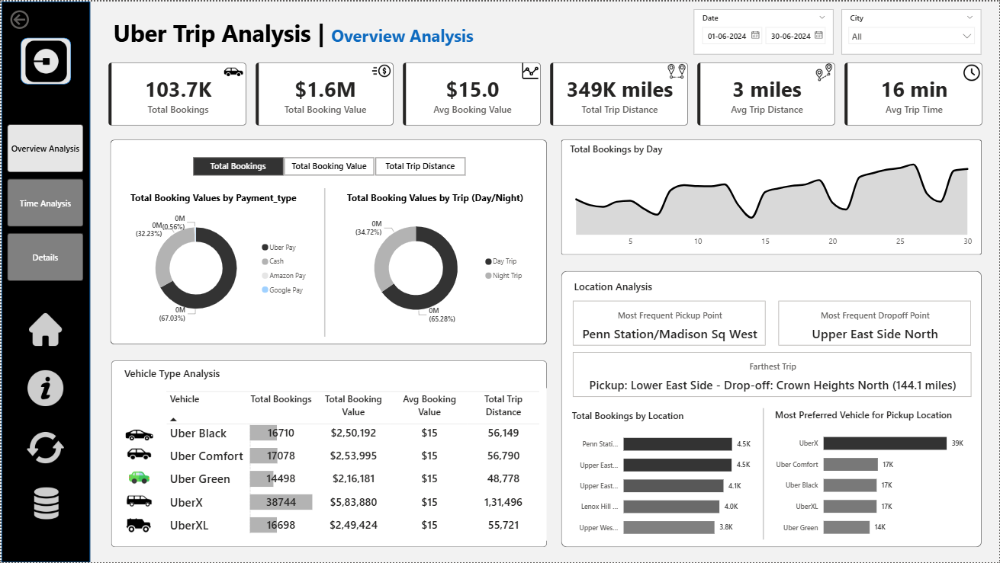

# 📊 Uber Dashboard

This Power BI dashboard offers a comprehensive analysis of Uber trip data, providing actionable insights into trip trends, revenue patterns, and operational efficiency.

---

## 🌐 View Interactive Dashboard
👉 [Click here to view the live Power BI dashboard](https://app.powerbi.com/view?r=eyJrIjoiZDg0ZGU0NGQtYmNjMy00ZDM4LThmNTEtZmYwODM3ZGM1MTRkIiwidCI6IjljNjM5OGM0LTllMDktNDM2Ni1iOTNlLTEwNThiOGE5YTkyOCJ9).

---

 ## 📸 Dashboard Preview

  
  &nbsp;|&nbsp;
  
  
  &nbsp;|&nbsp;
  

 
---

## 🧠 Overview
 - The dashboard is designed to analyze key metrics across several dimensions:
 - Total Bookings: 103.7K
 - Total Booking Value: $1.6M
 - Total Trip Distance: 349K miles
 - Avg Trip Time: 16 minutes
 - It is broken down into three main sections:

 1. Overview Analysis
 - This section provides a high-level summary of the entire trip dataset, including:
 - Booking values by Payment Type (e.g., Uber Pay, Cash, Amazon Pay).
 - Booking values by Trip Type (Day Trip vs. Night Trip).
 - Vehicle Type Analysis (e.g., UberX, Uber Black, Uber Comfort) showing total bookings, value, and distance.
 - Location Analysis, identifying the most frequent pickup/dropoff points and the farthest trip.

2. Time Analysis
 - This section focuses on time-based trends to identify peak demand hours and days:
 - Total bookings by Pickup Time (hourly distribution).
 - Total bookings by Day Name (weekly trend).
 - A heatmap showing total bookings by the hour of the day and day of the week, clearly identifying peak demand windows.

3. Details
 - A detailed table view of individual trips, showing all the granular data used for the analysis, including Trip ID, Vehicle Type, Booking Value, Pickup Location, and Trip Distance.

---

## 🛠️ Tools & Technologies
- **Power BI** for visualization  
- **DAX** for custom metrics  
- **Power Query** for data transformation  
- **Excel/CSV** dataset as input source  

---

## 📁 Folder Structure
    social-media-analytics-dashboard/
    │
    ├── Social_Media_Analytics.pbix 
    ├── Social Media Analysis (Dataset).xlsx 
    ├── img 
    └── README.md 

---

## 🚀 How to Use
1. Download the file **Uber Dashboard.pbix**  
2. Open it in **Power BI Desktop** (free tool from Microsoft)  
3. Explore visuals, filters, and slicers interactively  
4. Connect your own data if desired  

---

## 📈 Key Insights

 - Identify peak booking hours (e.g., 5 PM - 8 PM) and days (e.g., Saturday and Sunday).

 - Determine the most profitable vehicle type (e.g., UberX with $5.83M in booking value).

 - Pinpoint high-demand locations for targeted driver deployment and operational planning (e.g., Penn Station/Madison Sq West).

 - Analyze payment type preferences to optimize payment processing (e.g., Uber Pay at 67.03%).

---

## 👩‍💻 Author
**Namrata Shitole**  
🌐 [LinkedIn Profile](https://www.linkedin.com/in/namrata-shitole-2a800536)